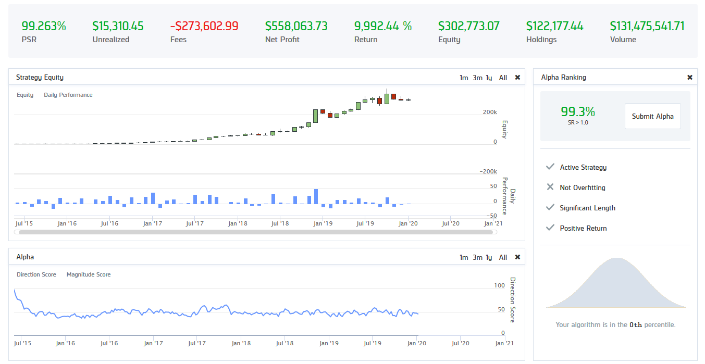

# microcap_short - Gap Up Shorting Penny Stocks

Everybody who is interested in micro cap oder penny stock sector know that these stocks fail most of the time. However, there are short bursts of excitement in some stock with massive upswings. Usually news fuel irrational price action and 'pump' the stock, which can happen very quickly as those stocks have often a low amount of outstanding shares and are cheap. After this 'bubble phase', these stocks often collapse creating amazing short opportunities, if one could enter at the right time.

I explored whether one could just simply short the penny stocks which 'gap up' pre-market and then emit short signals for the market open. In principle the strategy is simple and very successful in backtesting (Fig.). However, likely flaws are the typical large bid/ask spread in these equities which is not accounted for in the backtest and that one cannot trade the market open as easily as you might think (see also https://www.youtube.com/watch?v=m7IPbPg_ME8 ). On top of that, there are constraints for short sellers like the unavailabitlity of shares to borrow, which are not included in the backtest. Overall, this strategy is also too good to be true: No efficient market would allow such a high-return strategy with relatively low risk.

The algorithm is executed on the QuantConnect platform ( www.quantconnect.com ). I use AWS Lambda functions to scrape the pre-market activity from the NASDAQ website ( https://www.nasdaq.com/market-activity/pre-market ) and scrape the penny stocks with high activity from FinVIZ. All stocks, which gapped up above 2 stddev of their historical returns are ranked and shorted at the market open. QuantConnect does not allow a direct download of the files, so I have to go through Dropbox. 
